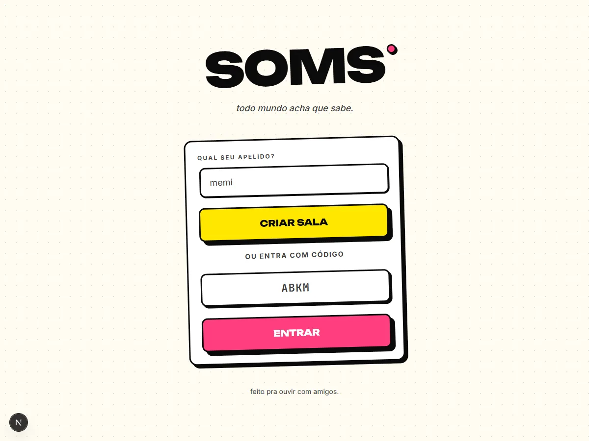

# SOMS

A real-time multiplayer music quiz: everyone hears the same 30 second clip at
the same moment and races to type the title, the artist and any featured
artists before the others do.

[Case study](https://luantaraschi.dev/en/projeto-soms.html)



## Overview

A host opens a room, picks genres and decades, and shares a four character
code. Players join from their phones, no account required. Each round plays an
audio preview and opens three kinds of answer slot: one for the title, one for
the main artist, one for each featured artist. Points go to whoever fills a
slot first, scaled by how fast they got there.

The interesting part is not the quiz. It is that a party game played on a
dozen phones at once has to agree on what happened and in what order, while
every client is on a different network with a different clock, and the audio
they are racing against has to start at the same instant for all of them.
Every decision below follows from that.

Answer checking, scoring, timing and round transitions all run on the server.
The browser renders state and sends text; it never decides whether a guess was
right or how many points it earned.

## Architecture

```
Browser (Next.js 15, React 19)
   |  Socket.IO, typed events
   v
Realtime server (Fastify 5 + Socket.IO)
   |
   +-- RoomManager ......... rooms, players, status transitions (in memory)
   +-- GameSessionStore .... slots, fills, scores, per-player rate limit
   +-- RoundRunner ......... countdown -> playing -> reveal state machine
   +-- Preloader ........... refetches fresh Deezer preview URLs
   |
   +--> Deezer HTTP API (token bucket, 8 req/s)
   +--> PostgreSQL via Prisma (track catalog, and finished games)
```

`apps/web` is the Next.js client. `apps/realtime` owns the game. The shared
rules that both sides need, scoring formula, text normalization, round
end conditions, live in `packages/shared` so the client can predict what the
server will say without being the one to decide it. `packages/deezer` wraps the
music provider, `packages/db` holds the Prisma schema.

Full design notes are in [`docs/project/ARCHITECTURE.md`](docs/project/ARCHITECTURE.md).

## Engineering Highlights

### Expired preview URLs, refetched before the game starts

Deezer preview URLs carry a signed CDN token that decays in roughly thirty
minutes. Any `previewUrl` sitting in Postgres is therefore already assumed
dead, and finding that out when the round starts means a silent round and a
ruined game.

`preloadRoundQueue` ([`apps/realtime/src/game/preloader.ts`](apps/realtime/src/game/preloader.ts))
runs before the first countdown. It refetches every selected track in
parallel, plus a set of spares, and keeps the ones that come back with a
usable preview. Dead tracks are replaced by spares in order. If nothing comes
back it returns `DEEZER_UNAVAILABLE`; if too few survive it returns
`INSUFFICIENT_FRESH_TRACKS` with the counts. Either way the game refuses to
start instead of starting broken.

Requests to Deezer go through a token bucket capped at 8 requests per second
([`packages/deezer/src/rate-limit.ts`](packages/deezer/src/rate-limit.ts)),
comfortably under the public limit, so preloading twenty tracks at once does
not get the server throttled.

### Two kinds of state transition, and the host only gets one

A room moves through `lobby`, `countdown`, `playing`, `reveal`, `ended`. If
every transition were a socket event the host could send, a modified client
could skip straight from `lobby` to `reveal` and read the answers.

`RoomManager` keeps two separate allow-lists. `HOST_TRANSITIONS` contains
exactly two entries, `lobby->countdown` and `ended->lobby`, which is the whole
set of moves a person is allowed to ask for. Everything else lives in
`SYSTEM_TRANSITIONS` and can only be reached through `systemTransition`, called
by the round runner's own timers. An unknown pair is rejected with
`INVALID_STATUS_TRANSITION` rather than being applied.

### A round that ends when it is actually over

Ending on a fixed 30 second timer wastes everyone's time when all the answers
are in after 9 seconds. Ending the instant the last slot is filled is unfair,
because two people who typed the same answer 40ms apart deserve the same
outcome.

`shouldEndRound` ([`packages/shared/src/round-state.ts`](packages/shared/src/round-state.ts))
ends the round early only when every slot has a winner *and* a 200ms tie
window has closed on each one. Anyone landing inside that window is recorded
as a tie and scores exactly what the first person scored, no bonus and no
penalty. The runner polls this condition every 500ms alongside the hard
timeout, so a round ends either when it is genuinely finished or at 30 seconds,
whichever comes first.

### Scoring that survives a slow network

Score is computed from `tIntoRoundMs`, the offset between the server's round
start and the server's receipt of the guess, never from a client timestamp:

```
points = slot.basePoints + round(50 * max(0, 1 - tIntoRoundMs / durationMs))
```

Title is worth 100 base, main artist 60, each feature 40. Guesses are compared
after normalization that strips diacritics, folds case, deletes apostrophes so
`Ain't` matches `aint`, and turns remaining punctuation into spaces so
`Do I Wanna Know?` matches `do i wanna know`. Each player is rate limited to
one guess per 400ms server-side, which stops dictionary spamming without
punishing fast typists.

### Games persist once, atomically, when they are over

Writing every guess to Postgres as it arrives would put a database round trip
in the middle of the tightest loop in the app. Instead the entire session
lives in memory and `persistFinishedGame`
([`apps/realtime/src/game/persister.ts`](apps/realtime/src/game/persister.ts))
writes it in a single Prisma transaction after the last round: upsert the
users, upsert the room, create the game, create a row per completed round. A
failure aborts the whole transaction, so there is no half-written game in the
history. The write is fired without blocking the `game:ended` broadcast, so a
slow database delays nobody's results screen.

### Room codes people can read out loud

Codes are 4 characters from a 24 letter alphabet with `I` and `O` removed, so
nobody types `1` for `I` or `0` for `O` when a friend reads a code across the
room. Characters come from `node:crypto`'s `randomInt` rather than
`Math.random`, and generation retries against the set of live codes until it
finds a free one. That is 331,776 combinations, which is plenty for
simultaneous rooms and is documented as a known ceiling rather than treated as
infinite.

## Tech Stack

| Layer | Choice | Role in this project |
|---|---|---|
| Client | Next.js 15, React 19, Tailwind 4 | Room UI and game screens |
| Client state | Zustand | Local room and identity stores, hydration gate |
| Transport | Socket.IO 4 | Typed bidirectional events |
| Server | Fastify 5, Node 22 | HTTP surface and Socket.IO host |
| Logging | pino | Structured logs per room and round |
| Data | PostgreSQL 16, Prisma | Track catalog and finished game history |
| Music | Deezer API | Track metadata and 30 second previews |
| Monorepo | pnpm workspaces | Two apps, four shared packages |

## Testing & Reliability

The realtime server carries 105 test cases across 7 Vitest files in
[`apps/realtime/test/`](apps/realtime/test/):

- `room-manager.test.ts` (46 cases) covers join, leave, kick, host transfer and
  every legal and illegal status transition.
- `socket-integration.test.ts` (19) drives a real Socket.IO client against a
  real server, including handshake rejection for bad nicknames and malformed
  user ids.
- `game-preload.test.ts` (15) covers dead tracks, spare substitution and both
  preload failure codes.
- `game-loop-integration.test.ts` (14) runs whole games with the round
  durations injected as milliseconds, so a full match is exercised without
  waiting 30 seconds per round.
- `game-start-integration.test.ts` (4), `code-generator.test.ts` (5) and
  `smoke.test.ts` (2) cover the rest.

`RoundRunner` takes its countdown, round and reveal durations through a config
object precisely so tests can compress them. Every timer it creates is tracked
per room and cleared on room teardown, so an abandoned room does not leave
callbacks firing against deleted state.

Typechecking runs across the workspace with `pnpm typecheck`, linting with
ESLint 9 and typescript-eslint. There is no CI workflow in this repository yet
and no end to end browser suite.

## Running Locally

Requires Node 22+, pnpm 9+ and Docker.

```bash
docker compose up -d      # postgres:16-alpine on localhost:5432
pnpm install
pnpm db:migrate
pnpm db:seed              # populates the track catalog
pnpm dev                  # web on :3000, realtime on :8080
```

Copy `.env.example` to `.env` first. No Deezer credentials are needed anywhere:
the client only calls public `api.deezer.com` endpoints. Seeding does need
internet access, since it pulls two tracks per genre and HEAD checks each
preview before storing it.

## Trade-offs

**Live game state is in memory, not in Redis.** `RoomManager` and
`GameSessionStore` are plain JavaScript maps. This keeps every read in the hot
path free, makes the game logic synchronous and easy to test, and removes a
whole class of serialization bugs. The cost is real: the realtime server
cannot be horizontally scaled, and a restart drops every room in progress.
Moving the stores behind Redis is the documented next step, and the
`UPSTASH_*` variables sitting unused in `.env.example` are placeholders for it.

**Guesses are not persisted.** Finished games store rounds and final scores
but not the individual guesses. That was a deliberate product decision, not an
oversight; it keeps the end of game transaction small. Per guess analytics
would need a schema change.

## Known Limitations

- No public deployment. The case study has recorded footage; running it
  yourself needs Docker.
- Room codes have a 331,776 code ceiling and collisions are handled by retry,
  which starts to matter well above any traffic this has seen.
- Sprint 1 answer matching is exact after normalization. There is no fuzzy
  matching, so a typo scores nothing. `GuessResult.CLOSE` exists in the schema
  as a reserved value for that work.
- Only the Classic mode is implemented. The other `RoomMode` values are in the
  schema but not playable.

## License

AGPL-3.0. See [`LICENSE`](LICENSE).
